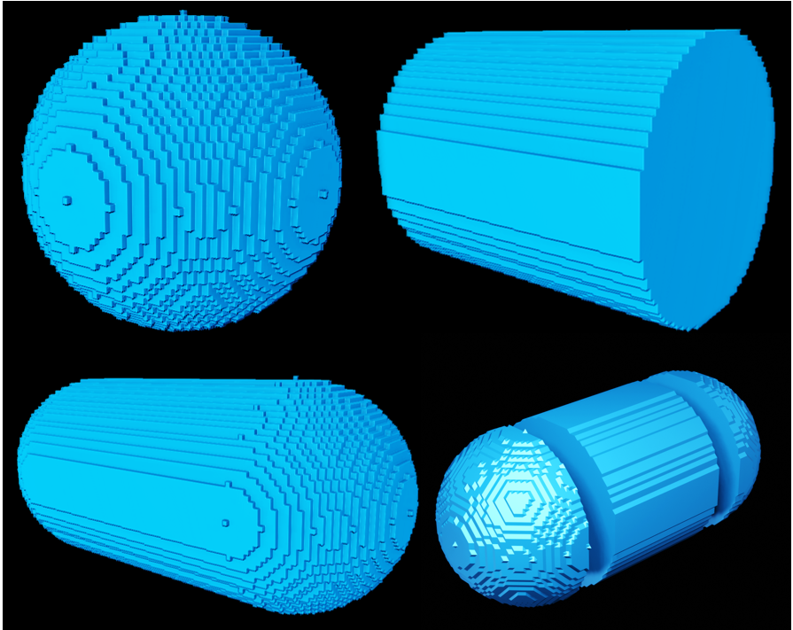

# Surface Area benchmark
To test how the theoretical surface area and volume correspond to figures calculated with known algorithms, we created a few primitive 3D figures, the surface area and volume of which can be derived from predefined basic properties, like radius for a sphere or radius and height for the cylinder.

## Sphere

The sphere surface area is calculated by formula
$$A = 4\pi r^2$$

The volume is calculated bz formula
$$V = \frac{4}{3}\pi r^3$$

## Cylinder

The sphere surface area is calculated by formula
$$A = 2\pi rh + 2\pi r^2$$

The volume is calculated by formula
$$V = \pi r^2  h$$

## Cylindroid
A cylindrycal object consisting from cylinder and semispheres on tops.
The surface area of such figure is the surface area of the cylinder without top parts(2πrh) and surface area of the sphere, 
added to tops.
The sphere surface area is calculated by formula
$$A_{sphere} = 4\pi r^2$$

The surface area of cylinder without its toppings is found by formula
$$A_{tube} = 2\pi rh$$

So the total surface area is calculated as:
$$A = 4\pi r^2  + 2\pi rh$$

The sphere volume is calculated by formula
$$V_{sphere} = \frac{4}{3}\pi r^3$$

The volume of cylinder is found by formula
$$A_{tube} = \pi r^2 h$$

So the total surface area is calculated as:
$$V = \frac{4}{3}\pi r^3  + \pi r^2 h$$

## Results

We calculate values in units, pretending that resolution = 1. Therefore surface area is expressed in square units, and volume - in cubic units.
In real conditions we multiply linear values by resolution, area values - by resolution squered, and volume values - by resulution in cube.
For example, when in units radius is 10, surface area found is 1372.04 and volume is 4169 then with resolution 0.1 mm the real word values will be the following
$$radius = 10 \cdot  0.1 = 1 mm$$ 
$$surface = 1372.04 \cdot  0.1^2 = 13.72 mm^2$$  
$$volume = 4169 \cdot 0.1^3 = 4.169 mm^3$$
(the relative errors in volume estimation therefore remain the same)

Overall, we see that surface area, calculated by *scikit-image* package, tends to overestimate the area by up to 9-10%. It can be attributed to the fact that isosurface, obtained by the Marching Cubes algorithm, is drawn over the tips of protruding segmented voxels covering some additional volume. However, with more extensive tests using different volumes, shapes, and resolutions, this bias can be evaluated more precisely and substracted from the surface area measurements.

|   |    name    | radius | height | surface by   formula | surface by   algorithm | difference area,   % | volume by formula | volume count | difference   volume, % |
|---|:----------:|:------:|:------:|:--------------------:|:----------------------:|:--------------------:|:-----------------:|:------------:|:----------------------:|
| 0 | sphere     | 10     |        | 1256,64              | 1372,04                | 9,18                 | 4188,79           | 4169         | -0,47                  |
| 1 | sphere     | 25     |        | 7853,98              | 8538,9                 | 8,72                 | 65449,85          | 65267        | -0,28                  |
| 2 | sphere     | 45     |        | 25446,9              | 27675,87               | 8,76                 | 381703,5          | 381915       | 0,06                   |
| 3 | cylinder   | 10     | 40     | 3141,593             | 3190,791               | 1,57                 | 12566,37          | 12200        | -2,92                  |
| 4 | cylinder   | 25     | 60     | 13351,77             | 13653,93               | 2,26                 | 117809,7          | 116460       | -1,15                  |
| 5 | cylinder   | 45     | 80     | 35342,92             | 36237,63               | 2,53                 | 508938            | 507920       | -0,2                   |
| 6 | cylindroid | 10     | 40     | 3769,911             | 3990,276               | 5,85                 | 16755,16          | 16369        | -2,3                   |
| 7 | cylindroid | 25     | 60     | 17278,76             | 18400,95               | 6,49                 | 183259,6          | 181727       | -0,84                  |
| 8 | cylindroid | 45     | 80     | 48066,37             | 51375,85               | 6,89                 | 890641,5          | 889835       | -0,09                  |
